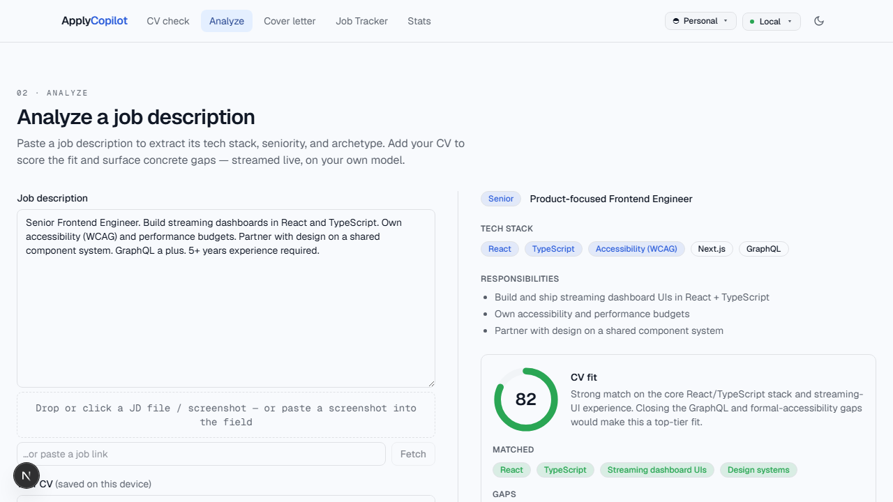
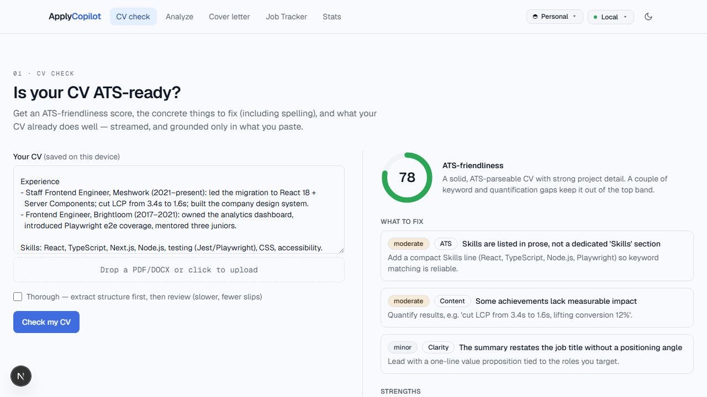
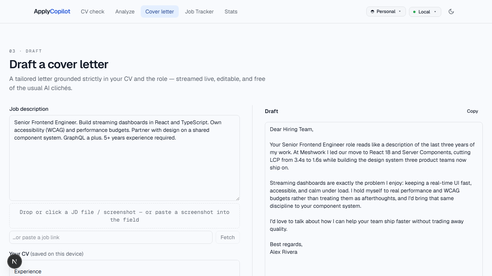
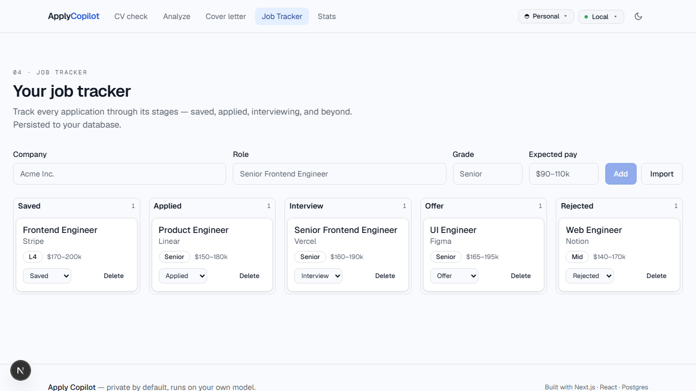

# Apply Copilot

[](https://github.com/Erebus1678/apply-copilot/actions/workflows/ci.yml)


An AI copilot for job applications. Paste a job description and it extracts the
tech stack, seniority, and role archetype; scores the fit against your CV with a
concrete gap list; drafts a tailored cover letter; and tracks every application
on a persistent pipeline board.

<p align="center">
  
</p>

**Private by default.** The AI layer is provider-agnostic — the same code runs
against a local model (LM Studio, Ollama) or any cloud provider (OpenAI,
Anthropic, OpenRouter, Groq, Together). Switch in the header, bring your own key
and model per device, and see each provider's health at a glance. Nothing has to
leave your machine — and built-in prompt compression trims input tokens on every
request.

## Screenshots

|                                  Analyze a JD against your CV                                  |                                        ATS-style CV review                                        |
| :--------------------------------------------------------------------------------------------: | :-----------------------------------------------------------------------------------------------: |
|  |                       |
|                                   **Tailored cover letter**                                    |                                  **Application pipeline board**                                   |
|                 |  |

> Screenshots use synthetic data and a mocked model — regenerate anytime with `pnpm capture`.

## Stack

- **Next.js (App Router) + React 19 + TypeScript**
- **Tailwind CSS v4** with an oklch design-token system + Storybook
- Provider-agnostic **streaming AI layer** (local · Ollama · OpenAI · Anthropic ·
  OpenRouter · Groq · Together) with BYO-key + token-saver compression
- Next API routes (Node) · **embedded PGlite** by default (no database to run) ·
  optional Postgres (Neon/Supabase) for a shared instance
- Quality: Jest + React Testing Library, Playwright, ESLint, Prettier,
  Lighthouse CI (Core Web Vitals), GitHub Actions, Docker

## Getting started

```bash
pnpm install
pnpm dev          # http://localhost:3000 — zero config: an embedded local DB
                  # is created on first run, no database to set up
```

That's it for the board, profiles, and CSV/JSON import — they work with **no
configuration**. To enable the AI features, pick a provider in the header (paste
a key per device), or set defaults up front:

```bash
cp .env.example .env.local   # optional: choose a default AI provider / keys
```

## Providers

Pick a default with `AI_PROVIDER` and configure only the one(s) you use. Every
provider can also be selected per session in the header, where you can paste a
**bring-your-own key** and pick a **model** (both stored on your device only). A
status dot shows whether each provider is reachable (local) or has a key (cloud).

The **model** values below are just sensible **defaults** — set the `*_MODEL` env
to change the default, or pick any model in the header per device. You're not
locked to these. One exception: for local servers (LM Studio / Ollama / 9Router)
the id must match exactly what the server reports (e.g. `qwen/qwen3-coder-30b`).

| Provider   | `AI_PROVIDER` | Key env              | Base URL env / default                           | Model env / default                                          |
| ---------- | ------------- | -------------------- | ------------------------------------------------ | ------------------------------------------------------------ |
| LM Studio  | `local`       | — (none)             | `LOCAL_AI_BASE_URL` · `http://localhost:1234/v1` | `LOCAL_AI_MODEL` · `qwen/qwen3-coder-30b`                    |
| Ollama     | `ollama`      | — (none)             | `OLLAMA_BASE_URL` · `http://localhost:11434/v1`  | `OLLAMA_MODEL` · `llama3.1`                                  |
| OpenAI     | `openai`      | `OPENAI_API_KEY`     | official                                         | `OPENAI_MODEL` · `gpt-4o-mini`                               |
| Anthropic  | `anthropic`   | `ANTHROPIC_API_KEY`  | official                                         | `ANTHROPIC_MODEL` · `claude-sonnet-4-6`                      |
| OpenRouter | `openrouter`  | `OPENROUTER_API_KEY` | `https://openrouter.ai/api/v1`                   | `OPENROUTER_MODEL` · `openai/gpt-4o-mini`                    |
| Groq       | `groq`        | `GROQ_API_KEY`       | `https://api.groq.com/openai/v1`                 | `GROQ_MODEL` · `llama-3.3-70b-versatile`                     |
| Together   | `together`    | `TOGETHER_API_KEY`   | `https://api.together.xyz/v1`                    | `TOGETHER_MODEL` · `meta-llama/Llama-3.3-70B-Instruct-Turbo` |

Every provider except Anthropic is OpenAI-compatible — add another by appending a
row to `src/lib/ai/providers.ts`. For LM Studio / Ollama, the model id must match
what the server reports (e.g. LM Studio needs the org prefix `qwen/...`).

## Configuration

Every knob is an environment variable with a sensible default — the app runs with
**none** set. Provider keys/models are in the table above; the rest:

| Variable               | Default            | What it does                                                         |
| ---------------------- | ------------------ | -------------------------------------------------------------------- |
| `DATABASE_URL`         | _(unset → PGlite)_ | Set to a Postgres URL to use a shared server DB instead of embedded  |
| `DIRECT_URL`           | _(unset)_          | Direct Postgres connection used to run migrations (pooled setups)    |
| `PGLITE_PATH`          | `./data/pgdata`    | Embedded DB dir. Use an **absolute** path under systemd/services     |
| `AI_RATE_LIMIT`        | `20`               | Max AI requests per window, per IP                                   |
| `AI_RATE_WINDOW_MS`    | `60000`            | Rate-limit window in ms                                              |
| `CV_MAX_BYTES`         | `5242880` (5 MB)   | Upload ceiling for CV files (raise for high-res scans)               |
| `COMPRESS_PROXY_URL`   | _(unset → off)_    | Route prompt text through an external compress proxy (opt-in egress) |
| `COMPRESS_PROXY_TOKEN` | _(unset)_          | Bearer token for the compress proxy                                  |
| `PORT`                 | `3000`             | Host port published by `docker compose` (container stays on 3000)    |

## Token savers

- **Built-in compression** (always on) — `src/lib/ai/compress.ts` trims the JD/CV
  prose (whitespace, blank runs, separator/duplicate lines) before every request,
  cutting input tokens with no meaning change. The analyze/cover-letter views show
  the estimated saving as you type.
- **External compress proxy** (opt-in) — set `COMPRESS_PROXY_URL` to route prompt
  text through a Headroom-style `/v1/compress` proxy (`{ text } -> { text }`,
  optional `COMPRESS_PROXY_TOKEN` bearer) before provider routing. Off by default;
  any failure or timeout falls back to the original prompt. **Note:** this sends
  prompt text off the box — opt-in egress.

## Scripts

| Script                                    | What it does                       |
| ----------------------------------------- | ---------------------------------- |
| `pnpm dev`                                | Run the dev server                 |
| `pnpm dev:lan`                            | Dev server on your LAN (`0.0.0.0`) |
| `pnpm build` / `pnpm start`               | Production build / serve           |
| `pnpm typecheck`                          | `tsc --noEmit`                     |
| `pnpm lint`                               | ESLint                             |
| `pnpm format` / `pnpm format:check`       | Prettier write / check             |
| `pnpm test` / `pnpm test:coverage`        | Jest + RTL                         |
| `pnpm e2e`                                | Playwright end-to-end              |
| `pnpm capture`                            | Regenerate README screenshots/GIF  |
| `pnpm storybook` / `pnpm build-storybook` | Component workshop                 |

## Self-hosting & LAN sharing

Run the whole thing on your own machine with **one command** — no database to
install, no migration step:

```bash
docker compose up -d --build   # then open http://localhost:3000
```

The container ships an **embedded PGlite** database (persisted in the `app-data`
volume, auto-migrated on first boot), so there's nothing else to run. The image
is a multi-stage build of Next.js standalone output (`Dockerfile`).

### Share it on your LAN

The server listens on `0.0.0.0`, so other devices on your network can use the
same instance — handy for sharing a tracker with a partner or across your phone
and laptop:

1. Find your machine's LAN IP (`ipconfig` on Windows, `ip addr` / `ifconfig` on
   macOS/Linux) — e.g. `192.168.1.50`.
2. From any device on the network, open `http://192.168.1.50:3000`.
3. Each person picks their own **profile** in the header — applications are
   scoped per profile, so trackers stay separate on the shared instance.

Running without Docker? `pnpm build && pnpm start` already binds `0.0.0.0`; for
the dev server use `pnpm dev:lan`. (Allow port 3000 through your firewall.)

### AI provider

By default the AI runs against an [LM Studio](https://lmstudio.ai) server on the
host (`http://host.docker.internal:1234/v1`) — nothing leaves your machine. To use
a cloud model instead, set `AI_PROVIDER` and the matching key in `.env` (or just
pick a provider in the header). AI is entirely optional — the tracker works
without it.

### Prefer a shared Postgres?

Set `DATABASE_URL` (and `DIRECT_URL` for migrations) to a Postgres instance
— Supabase, Neon, or your own — and the app switches drivers automatically.
Generate/apply the schema with `pnpm db:generate` / `pnpm db:migrate`.

## Quality & performance

- **Accessibility** — components are checked with `jest-axe`; Lighthouse CI gates the a11y score at ≥ 0.9.
- **Core Web Vitals** — Lighthouse CI runs on every push (`lighthouserc.json`) and watches LCP ≤ 2.5s, CLS ≤ 0.1, TBT ≤ 200ms, FCP ≤ 1.5s.
- **Coverage** — Jest enforces ≥ 80% statements/lines on application logic (integration boundaries are covered by Playwright + live checks).
- **Rate limiting** — the AI endpoints are IP-rate-limited (in-memory, 20 req/min by
  default; tune with `AI_RATE_LIMIT` / `AI_RATE_WINDOW_MS`). The limit is **per
  instance** (not shared across replicas), and the client IP is read from
  `x-forwarded-for` — only trustworthy behind a reverse proxy you control.

## Editions (OSS vs SaaS)

This is the **open-source edition** — local-first, self-hostable, no account
required. A hosted SaaS edition is planned as a thin, env-gated layer on the
**same codebase** (shared Postgres, accounts, operator-funded tokens, billing) —
never a fork. The seams already exist: the `DATABASE_URL` dual driver, the
`profileId` tenancy column, and server-side per-provider keys. See
**[EDITIONS.md](EDITIONS.md)** for the full decision record.

## Roadmap

Rough direction, not a promise — issues and 👍 reactions steer priority:

- **Prebuilt image** — publish a GHCR image so self-host is `docker compose up`
  with no local build (workflow already in `.github/workflows/publish.yml`).
- **Save analysis to the board** — turn an Analyze fit score into a tracked
  application in one click (today the board and analyze are separate).
- **CV OCR fallback** — read scanned/image-only PDFs, not just text PDFs.
- **More providers** — Mistral, Gemini, and other OpenAI-compatible endpoints.
- **Hosted SaaS edition** — the env-gated layer described in [EDITIONS.md](EDITIONS.md).

## Contributing

Issues and PRs welcome — see **[CONTRIBUTING.md](CONTRIBUTING.md)** for setup and
the checks CI runs, and **[CHANGELOG.md](CHANGELOG.md)** for what's shipped.

## License

[MIT](LICENSE) © 2026 Dmytro
